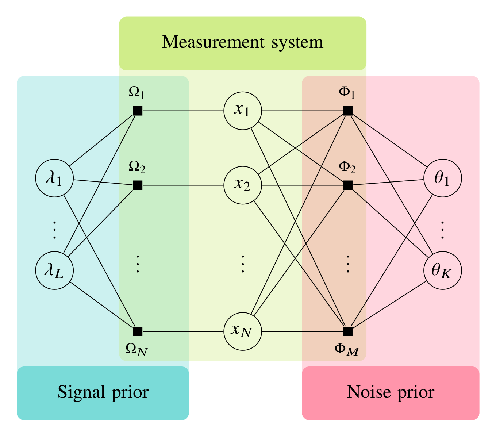

# 1-bit Compressive Sensing via AMP with Built-in Parameter Estimation
* `1-bit Compressive Sensing` (CS) tries to recover a sparse signal from quantized 1-bit measurements.
* `1-bit CS` can be straightforwardly extended to `multi-bit CS` that tries to recover a sparse signal from quantized multi-bit measurements.
* We propose to solve the two problems using the proposed `AMP with built-in parameter estimation` (**AMP-PE**) [1].
* AMP-PE offers a much simpler way to estimate the distribution parameters, which allows us to directly work with true quantization noise models.
{width=100%}

* This package contains code files to implement the approach described in the following paper.
```
@article{1bitCS_AMP_PE,
    author    = {Shuai Huang and Trac D. Tran},
    title     = {1-Bit Compressive Sensing via Approximate Message Passing with Built-in Parameter Estimation},
    journal   = {CoRR},
    volume    = {abs/2007.07679},
    year      = {2020},
    url       = {http://arxiv.org/abs/2007.07679},
    archivePrefix = {arXiv},
    eprint    = {2007.07679}
}
```
If you use this package and find it helpful, please cite the above paper. Thanks :smile:
{width=50%}


## Summary
```
    ./src          -- This folder contains MATLAB files to recover the signal from 1-bit and multi-bit measurements.
    ./demo         -- This folder contains demo files to run experiments in the paper, detailed comments are within each demo file.
```
## Usage

AMP-PE adopts the GAMP formulation [2], and, correspondingly, there are two versions of the AMP-PE algoritm:

* The `vector` AMP-PE: As shown in Algorithm 1 of our paper, the component-wise "square" of the measurement matrix `A`, i.e. `A.^2`, is used to compute the variances of the variables. 
* The `scalar` AMP-PE: This is a simplification to the vector AMP-PE. The `M` by `N` matrix `A.^2` is no longer supplied. Every entry `|a_{mn}|^2` of `A.^2` is approximated by `(||A||_F^2)/(MN)`, where `||A||_F` is the Frobenius norm of `A`.

The `scalar` AMP-PE is faster than `vector` AMP-PE.

You can follow the following steps to run the program. Detailed comments are within each demo file.


Open `MATLAB` and type the following commands into the console:

* Step 1) Try the `vector` AMP-PE to recover the signal from noisy 1-bit, 2-bit and 3-bit measurements.
```
    >> addpath(genpath('./'))
    >> noisy_recovery_1bit_vect
    >> noisy_recovery_2bit_vect
    >> noisy_recovery_3bit_vect
```
* Step 2) Try the `scalar` AMP-PE to recover the signal from noisy 1-bit, 2-bit and 3-bit measurements.
```
    >> addpath(genpath('./'))
    >> noisy_recovery_1bit_scalar
    >> noisy_recovery_2bit_scalar
    >> noisy_recovery_3bit_scalar
```
* Step 3) Try the State Evolution (SE) analysis of the proposed AMP-PE approach.
```
    >> addpath(genpath('./'))
    >> noisy_SE_1bit
    >> noisy_SE_2bit
    >> noisy_SE_3bit
```


## Reference

[1] S. Huang and T. D. Tran, "Sparse signal recovery using generalized approximate message passing with built-in parameter estimation," in Proceedings of IEEE ICASSP, March 2017, pp. 4321–4325.
[2] S. Rangan, "Generalized approximate message passing for estimation with random linear mixing," in Proceedings of IEEE ISIT,  July 2011, pp. 2168–2172.